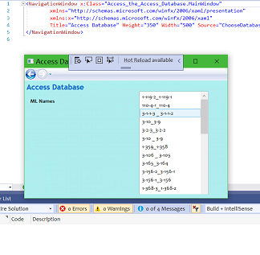

# Access the Access Database
This is a coding challenge given to me by ITpipes. The challenge was to create a WPF application that allows a user to browse to and select an Access database to open. It then should connect to the database and retrieve a list of the ML.ML_Name fields and display the results in a ListBox.

I found three models that I used to write the program. First was a WPF application which outlined the basic layout and styling of my pages. The next was a program which displayed the data in an Access database, though in the form of a DataGrid. The third demostrated how to create a functioning ListBox. I combined these three to create the basic program and to perform the second half of the challenge.

                   

I hit a roadblock, however, when it came to the first part, allowing the user to choose an Access file from which to draw the given data fields. I was able to make this functional, but I did not find a way to make the connection string dynamic. Since Access uses an OleDbConnection, I had to be able to modify the connection string at runtime. I used an event handler to create an OpenFileDialog file, and used the .FileName to set the UserId attribute in the ConnectionString element. While debugging showed that I was getting the correct file path, it was still throwing an error. Here's why: whenever the program inserted the OpenFileDialog file.FileName, it converted the name from, say, "C:\users\me\filepath\database.mdl" into "C:\\\users\\\filepath\\\database.mdl"

Every method I used had the same effect. From straight concatenation to Stringbuilder to OleDbConnectionStringBuilder, they all gave the double slash result. I have not discovered a workaround, nor have I found useful advice on the subject. Here is just one example of the code I used:

```
  OleDbConnectionStringBuilder builder = new OleDbConnectionStringBuilder();
  builder.Provider = "Microsoft.Jet.OLEDB.4.0";
  builder.DataSource = openFileDlg.FileName;
  builder["User Id"] = "admin;Password=;";
```
There were many others.

This is the point where I would normally call on someone with more experience with these operations to give me some guidance. I'm sure there is a solution out there, and when I find it I will be editing this README file!

